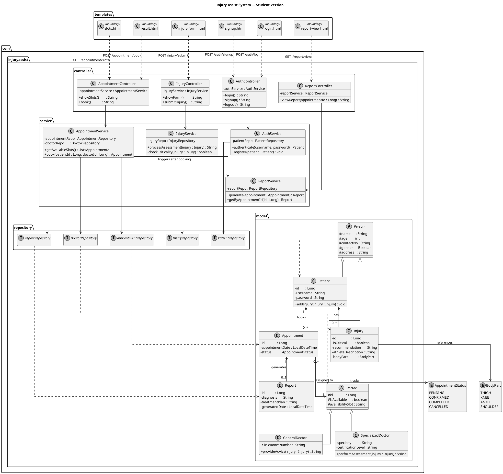

> Team of 4 · 2nd year CS students · 2 weeks · Spring Boot + Thymeleaf + Tailwind + Alpine.js

---

## Table of Contents

1. [Tech Stack](#tech-stack)
2. [Complete UML](#complete-uml)
3. [Project Structure](#project-structure)
4. [Milestone 1 — Domain Model](#milestone-1--domain-model--days-1-3)
5. [Milestone 2 — Service Layer + Security](#milestone-2--service-layer--security--days-4-7)
6. [Milestone 3 — Controllers + UI](#milestone-3--controllers--thymeleaf-ui--days-8-11)
7. [Milestone 4 — Polish + Submission](#milestone-4--polish--submission--days-12-14)
8. [Git Workflow](#git-workflow)
9. [Coding Rules](#coding-rules)

---

## Tech Stack

| Layer | Choice | Why |
|---|---|---|
| Language | Java 17 | LTS, familiar from coursework |
| Framework | Spring Boot 3.x | Auto-config, no boilerplate |
| Templating | Thymeleaf | Plain HTML files, no build step |
| Styling | Tailwind CSS (CDN) | One script tag, no config |
| Interactivity | Alpine.js (CDN) | One script tag, Vue-like, zero build |
| Database | H2 (dev) | Runs in memory, no install needed |
| ORM | Spring Data JPA | Repositories write themselves |
| Security | Spring Security | Login/logout in ~30 lines |
| Build | Maven | Standard in CS courses |

> **Why Alpine.js over Vue?**
> Vue requires Vite/Webpack — that is a 3-day setup detour.
> Alpine drops in via one `<script>` tag and handles every toggle, pill selector,
> and form interaction you need. Same syntax feel, zero build config.

---

## Complete UML

Copy this into [plantuml.com](https://plantuml.com) to render the diagram.



---

## Project Structure

```
src/
├── main/
│   ├── java/com/injuryassist/
│   │   ├── config/
│   │   │   ├── SecurityConfig.java
│   │   │   └── CustomUserDetailsService.java
│   │   ├── controller/
│   │   │   ├── AuthController.java
│   │   │   ├── InjuryController.java
│   │   │   ├── AppointmentController.java
│   │   │   └── ReportController.java
│   │   ├── model/
│   │   │   ├── Person.java
│   │   │   ├── Patient.java
│   │   │   ├── Doctor.java
│   │   │   ├── GeneralDoctor.java
│   │   │   ├── SpecializedDoctor.java
│   │   │   ├── Injury.java
│   │   │   ├── Appointment.java
│   │   │   ├── Report.java
│   │   │   ├── BodyPart.java
│   │   │   ├── AppointmentStatus.java
│   │   │   └── Gender.java
│   │   ├── repository/
│   │   │   ├── PatientRepository.java
│   │   │   ├── InjuryRepository.java
│   │   │   ├── DoctorRepository.java
│   │   │   ├── AppointmentRepository.java
│   │   │   └── ReportRepository.java
│   │   └── service/
│   │       ├── AuthService.java
│   │       ├── InjuryService.java
│   │       ├── AppointmentService.java
│   │       └── ReportService.java
│   └── resources/
│       ├── templates/
│       │   ├── layout/base.html
│       │   ├── auth/login.html
│       │   ├── auth/signup.html
│       │   ├── injury/form.html
│       │   ├── injury/result.html
│       │   ├── appointment/slots.html
│       │   └── report/view.html
│       ├── static/css/custom.css
│       └── application.properties
```

### `application.properties`

```properties
spring.datasource.url=jdbc:h2:mem:injurydb
spring.datasource.driver-class-name=org.h2.Driver
spring.jpa.hibernate.ddl-auto=create-drop
spring.h2.console.enabled=true
spring.h2.console.path=/h2-console
spring.thymeleaf.cache=false
```

---

## Milestone 1 — Domain Model · Days 1-3

**Goal:** Every entity class exists, JPA relationships are wired, tables appear in H2.

### What to build

- Spring Boot project from [start.spring.io](https://start.spring.io) with dependencies: Spring Web, Thymeleaf, Spring Data JPA, Spring Security, H2, Validation, Lombok
- All `@Entity` classes: `Patient`, `Injury`, `Appointment`, `Report`
- `Person` abstract base class (`@MappedSuperclass`)
- `Doctor` abstract base + `GeneralDoctor` + `SpecializedDoctor`
- 3 enums: `BodyPart`, `AppointmentStatus`, `Gender`
- All 5 empty repository interfaces (no methods needed yet)
- `application.properties` with H2 config above

### Team roles

| Developer | Owns |
|---|---|
| Dev 1 | `Person.java`, `Patient.java`, `Doctor.java` + all enums |
| Dev 2 | `Injury.java`, `Appointment.java`, `Report.java` + JPA relationships |
| Dev 3 | Spring Boot project creation, `pom.xml`, `application.properties` |
| Dev 4 | All 5 repository interfaces + first `@DataJpaTest` |

### How to verify

- `./mvnw spring-boot:run` boots with no errors
- H2 console at `http://localhost:8080/h2-console` shows all tables
- FK columns exist — e.g. `patient_id` on the `injury` table
- One `@DataJpaTest` saves and retrieves a `Patient` successfully

### Search keywords for this milestone

```
@Entity JPA annotation
@MappedSuperclass Spring
@OneToMany @ManyToOne JPA
JpaRepository Spring Data
JPA inheritance JOINED TABLE_PER_CLASS
@Enumerated EnumType.STRING
H2 in-memory database Spring Boot
@DataJpaTest Spring Boot test
```

---

## Milestone 2 — Service Layer + Security · Days 4-7

**Goal:** All business logic works and is unit-tested. Spring Security blocks unauthenticated users.

### What to build

- `AuthService`: `register()` with BCrypt encoding, `authenticate()`
- `InjuryService`: `processAssessment()` calls private `checkCriticality()` — returns true for KNEE and SHOULDER
- `AppointmentService`: `getAvailableSlots()`, `book()`, `cancel()`
- `ReportService`: `generate(appointment)`, `getByAppointmentId()`
- `AppointmentService` calls `ReportService.generate()` after a successful booking
- `SecurityConfig`: all routes protected except `/auth/**` and `/h2-console/**`
- `CustomUserDetailsService`: loads a `Patient` by username for Spring Security

### Team roles

| Developer | Owns |
|---|---|
| Dev 1 | `AuthService` + `SecurityConfig` + `CustomUserDetailsService` |
| Dev 2 | `InjuryService` + `checkCriticality()` logic |
| Dev 3 | `AppointmentService` (book, cancel, list) + `ReportService` connection |
| Dev 4 | `ReportService` + unit tests for all 4 services |

### How to verify

- Unit test each service method (mock the repository with Mockito)
- `checkCriticality()` returns `true` for `KNEE` and `SHOULDER`, `false` for others
- Password is stored as a BCrypt hash — never plain text — visible in H2 console
- `GET /injury/form` without login → browser redirected to `/auth/login`

### Search keywords for this milestone

```
@Service annotation Spring Boot
@Autowired dependency injection Spring
BCryptPasswordEncoder Spring Security
SecurityFilterChain Spring Security 3
UserDetailsService Spring Security
Mockito @Mock @InjectMocks JUnit 5
@Transactional Spring service
JUnit 5 @ExtendWith SpringExtension
```

---

## Milestone 3 — Controllers + Thymeleaf UI · Days 8-11

**Goal:** A real user can click through the entire journey in the browser.

### What to build

- `base.html` Thymeleaf fragment — nav bar, Tailwind CDN link, Alpine.js CDN link
- `AuthController` + `login.html` + `signup.html`
- `InjuryController` + `injury-form.html` (Alpine.js body-part pill buttons) + `result.html`
- `AppointmentController` + `slots.html` (Alpine.js slot selector) + appointment list
- `ReportController` + `report-view.html`
- `@Valid` on form objects + Thymeleaf `th:errors` for inline validation messages

### Alpine.js body-part selector (paste into `injury-form.html`)

```html
<div x-data="{ selected: '' }">
  <template x-for="part in ['KNEE','ANKLE','SHOULDER','THIGH']" :key="part">
    <button
      type="button"
      @click="selected = part"
      :class="selected === part
        ? 'bg-teal-600 text-white border-teal-600'
        : 'bg-white text-gray-700 border-gray-300'"
      class="border-2 rounded-lg px-5 py-3 font-medium transition-colors m-1"
      x-text="part">
    </button>
  </template>
  <input type="hidden" name="bodyPart" :value="selected">
</div>
```

### Team roles

| Developer | Owns |
|---|---|
| Dev 1 | `AuthController` + `login.html` + `signup.html` |
| Dev 2 | `InjuryController` + `form.html` + `result.html` |
| Dev 3 | `AppointmentController` + `slots.html` + appointment list |
| Dev 4 | `ReportController` + `report-view.html` + `base.html` fragment |

### How to verify

- Full happy path works: signup → login → submit injury → see result → book slot → view report
- Critical injury (KNEE/SHOULDER) shows a red alert; non-critical shows green
- Submitting an empty form shows inline error messages per field
- Logout kills the session; protected pages redirect to login
- Every page uses `th:replace="layout/base :: base(...)"` — no repeated nav code

### Search keywords for this milestone

```
@Controller @GetMapping Spring MVC
Thymeleaf th:fragment th:replace
Thymeleaf th:each list loop
@Valid BindingResult Spring MVC
th:errors Thymeleaf form validation
Alpine.js x-data x-bind tutorial
Tailwind CSS CDN script tag
Model.addAttribute Spring MVC
redirect:/ Spring MVC controller
@PostMapping @ModelAttribute Spring
```

---

## Milestone 4 — Polish + Submission · Days 12-14

**Goal:** A peer can clone the repo and run the app in under 5 minutes with no manual setup.

### What to build

- `DataInitializer.java` — seeds 2 `GeneralDoctor` + 2 `SpecializedDoctor` records on startup using `CommandLineRunner`
- Brand color `#1D9E75` (teal) applied to primary buttons and nav
- Inter font from Google Fonts: `<link href="https://fonts.googleapis.com/css2?family=Inter:wght@400;500;600&display=swap">`
- Mobile layout check on every page using Chrome DevTools device mode
- Custom `error.html` for 404 and 500 errors
- `README.md` with: how to run, screenshots, UML image, team names

### `DataInitializer.java` skeleton

```java
@Component
public class DataInitializer implements CommandLineRunner {

    @Autowired private DoctorRepository doctorRepo;

    @Override
    public void run(String... args) {
        GeneralDoctor g1 = new GeneralDoctor();
        g1.setName("Dr. Ahmed");
        g1.setAvailable(true);
        g1.setAvailabilitySlot("Mon 09:00-12:00");
        g1.setClinicRoomNumber("101");
        doctorRepo.save(g1);

        SpecializedDoctor s1 = new SpecializedDoctor();
        s1.setName("Dr. Sara");
        s1.setSpecialty("Sports Medicine");
        s1.setAvailable(true);
        s1.setAvailabilitySlot("Tue 14:00-17:00");
        doctorRepo.save(s1);
    }
}
```

### Team roles

| Developer | Owns |
|---|---|
| Dev 1 | `DataInitializer.java` + `error.html` |
| Dev 2 | Brand colors, Inter font, mobile layout fixes |
| Dev 3 | `README.md` — setup steps, screenshots, UML |
| Dev 4 | Final integration test of full journey + `git tag v1.0` |

### How to verify

- Fresh clone + `./mvnw spring-boot:run` → app runs with seeded doctors visible
- No plain-text passwords visible in H2 console — only BCrypt hashes
- All pages pass mobile check at 375px width in Chrome DevTools
- A peer follows README alone and reaches the report screen without asking for help

### Search keywords for this milestone

```
CommandLineRunner Spring Boot seed data
custom error page Spring Boot Thymeleaf
Google Fonts CDN import HTML
Chrome DevTools device mode responsive
README markdown good structure
git tag push origin
```

---

## Git Workflow

One branch per milestone. Merge into `main` only when the milestone's verify checklist passes.

```bash
# Start a milestone
git checkout -b milestone-1-domain

# Daily commits
git add .
git commit -m "feat: add Patient and Injury entities with JPA mappings"

# Merge when done
git checkout main
git merge milestone-1-domain

# Tag the final submission
git tag v1.0
git push origin v1.0
```

**Commit message format:** `type: short description`

Types: `feat` `fix` `refactor` `test` `docs`

---

## Coding Rules

These are the 5 rules that will save the team the most debugging time.

**Rule 1 — No logic in controllers.**
Controllers call one service method and return a view name. If you write an `if` statement inside a controller, move it to the service.

**Rule 2 — Never pass `@Entity` objects to Thymeleaf.**
Always add entity data to `Model` using primitive fields or a simple wrapper. Passing a JPA entity to a template causes lazy-loading crashes.

**Rule 3 — Passwords must be encoded.**
Use `BCryptPasswordEncoder`. Never store plain text. Check H2 console after registering — the password column must show `$2a$...`.

**Rule 4 — Validate all form inputs.**
Put `@NotBlank` and `@Min` on your form fields. Use `@Valid` in the controller and `th:errors` in the template. Never trust what comes from the browser.

**Rule 5 — Sync before milestone 3.**
Before anyone writes a controller, the whole team must agree on service method names and return types. One mismatched method name at the controller-service boundary wastes hours.

---

*Injury Assist — Student Project · Spring Boot + Thymeleaf + Tailwind + Alpine.js*